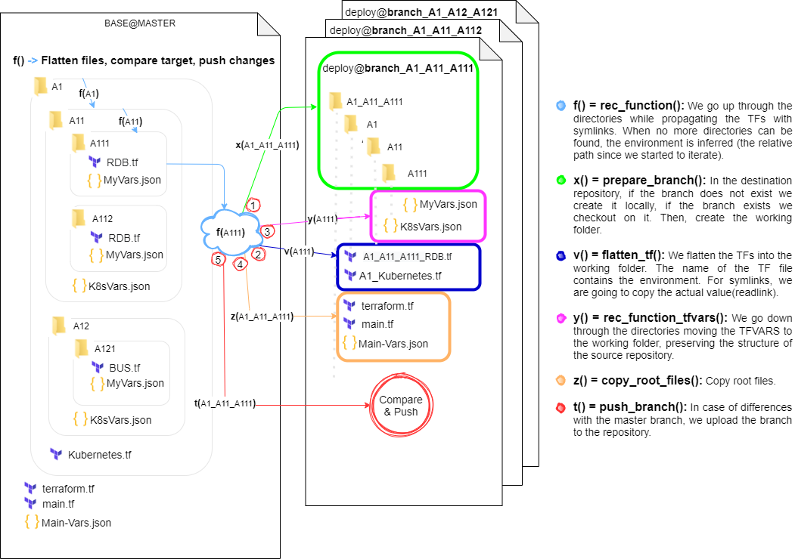

# FlattenFiles Bash action

This action is meant to be triggered when a change to Master happens on the editable Base repository.

###### REQUIREMENTS

Base repository must be standardized as the organization terraform´s repository template. 

## How it works

[Working draw](https://drive.google.com/file/d/1ThemqxL_icve3-OA_oXW5QUPoEiSGAlz/view?usp=sharing)



## Inputs

### `DEPLOY_FOLDER`

**Required** Deployment repository path on machine. Default `"$(pwd)/configfolder"`.

### `working-directory`

**Required** Terraform root folder. Default `'$(pwd)/iac'`.

## Outputs

### `TODO`


## Example usage

```yaml
uses: ./.github/actions/flatten
with:
  DEPLOY_FOLDER: ${{ steps.params.outputs.DEPLOY_FOLDER }} 
  working-directory: ${{ steps.params.outputs.working-directory }}
```

