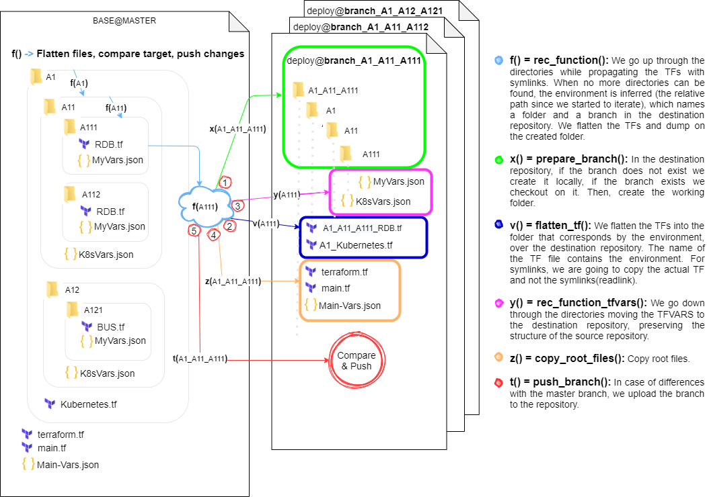

# FlattenFiles Bash action

This action is meant to be triggered when a change to Master happens on the editable Base repository.

###### REQUIREMENTS

Base repository must be standarized as the organization terraform´s repository template. 

## How it works

## Inputs

### `who-to-greet`

**Required** The name of the person to greet. Default `"World"`.

## Outputs

### `time`

The time we greeted you.

## Example usage

uses: actions/hello-world-docker-action@v1
with:
  who-to-greet: 'Mona the Octocat'